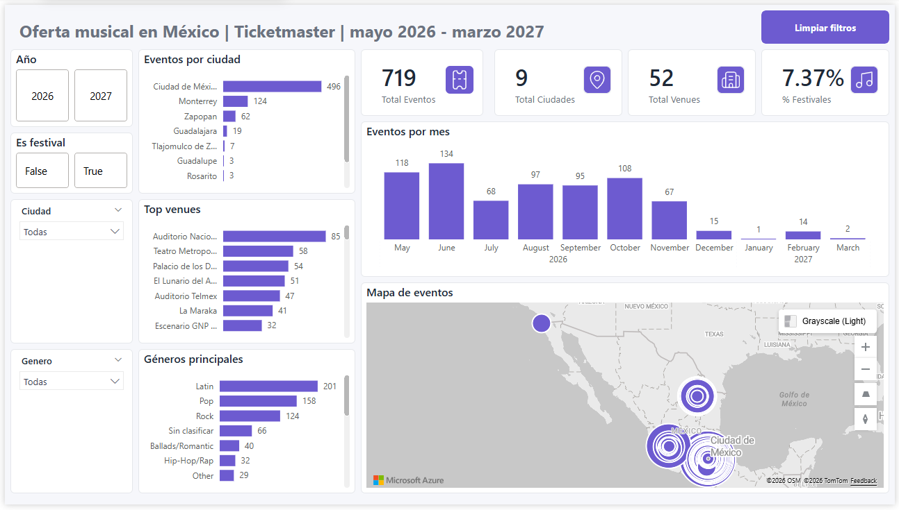
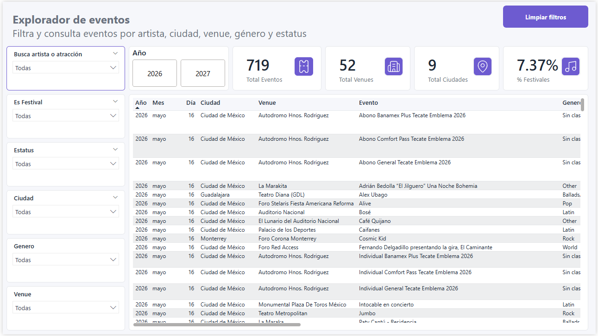

# Analisis de oferta musical con Ticketmaster API

Proyecto de Data Analytics sobre eventos musicales disponibles en Ticketmaster, con pipelines automatizados, datasets actualizables y dashboards publicados en Power BI Service.



> Nota: este README usa texto sin acentos para evitar problemas de codificacion al visualizar el proyecto en distintos entornos, editores o plataformas.

## Objetivo

Analizar la oferta musical publicada en Ticketmaster para identificar en que paises, ciudades, venues, meses, generos y artistas se concentra la actividad de eventos musicales.

El proyecto busca demostrar un flujo completo de analisis de datos:

- Extraccion de datos desde una API publica.
- Limpieza y normalizacion con Python.
- Preparacion de dataset para Power BI.
- Construccion de dashboard interactivo.
- Automatizacion diaria de actualizacion de datos.
- Publicacion en Power BI Service.
- Comunicacion de hallazgos para portafolio profesional.

## Fuente de datos

Los datos fueron obtenidos desde la Ticketmaster Discovery API v2.

Filtro principal utilizado:

- Pais: Mexico (`countryCode=MX`)
- Clasificacion: musica (`classificationName=music`)

Para la version LATAM se consultan varios paises de Latinoamerica. La disponibilidad final depende de los eventos publicados por Ticketmaster para cada pais al momento de la actualizacion.

La API devuelve informacion sobre eventos, fechas, venues, ciudades, coordenadas, artistas/atracciones, generos, estatus de venta y promotores.

## Herramientas utilizadas

- Python
- pandas
- requests
- python-dotenv
- Power BI Desktop
- Power BI Service
- GitHub Actions
- Ticketmaster Discovery API
- VS Code

## Proceso

1. Se creo una cuenta de desarrollador en Ticketmaster para obtener una API key.
2. Se extrajeron eventos musicales de Mexico mediante la Discovery API.
3. Se guardo una version cruda de los datos en formato JSON.
4. Se transformaron los datos en un CSV limpio para analisis.
5. Se normalizaron campos como ciudad, estado, genero y clasificacion de festivales.
6. Se preparo un dataset final optimizado para Power BI.
7. Se construyo una primera version del dashboard enfocada en Mexico:
   - Vista General
   - Explorador de Eventos
8. Se construyo una segunda version enriquecida para Latinoamerica:
   - Panorama LATAM
   - Artistas y Atracciones
   - Explorador de Eventos
9. Se automatizo la actualizacion diaria de datasets con GitHub Actions.
10. Se publicaron los reportes en Power BI Service.

## Estructura del proyecto

```text
conciertos-festivales-mexico/
  assets/
  data/
    raw/
    processed/
  docs/
    screenshots/
  powerbi/
  scripts/
  themes/
  README.md
  requirements.txt
```

## Scripts principales

```text
scripts/test_ticketmaster_api.py
```

Prueba la conexion con la API de Ticketmaster y muestra una muestra inicial de eventos.

```text
scripts/extract_ticketmaster_events.py
```

Extrae eventos musicales de Latinoamerica desde la API, guarda el JSON crudo y genera un CSV procesado para la version enriquecida.

```text
scripts/extract_ticketmaster_events_mx.py
```

Extrae eventos musicales de Mexico y genera los archivos usados por la V1 del dashboard.

```text
scripts/explore_ticketmaster_data.py
```

Genera un analisis exploratorio inicial del dataset.

```text
scripts/prepare_powerbi_dataset.py
```

Crea una version final del dataset con columnas seleccionadas y nombres amigables para Power BI.

```text
scripts/build_latam_enriched_model.py
```

Construye el modelo enriquecido LATAM con tabla de eventos, venues, atracciones y tabla puente evento-atraccion.

```text
scripts/run_mexico_pipeline.py
```

Ejecuta el pipeline completo de Mexico para actualizar la V1.

```text
scripts/run_latam_pipeline.py
```

Ejecuta el pipeline completo LATAM para actualizar la V2.

## Dashboard

El proyecto contiene dos versiones publicables del dashboard.

### V1 Mexico

Version enfocada en la oferta musical de Mexico. Mantiene un modelo plano, facil de explorar, con una tabla donde se puede ver cada evento junto con sus artistas o atracciones asociadas.

Paginas:

- Vista General
- Explorador de Eventos

### V2 LATAM

Version enriquecida con un modelo mas avanzado. Separa eventos, venues y atracciones en tablas relacionadas, permitiendo analizar presencia de artistas, links externos, imagenes, venues y eventos asociados.

Paginas:

- Panorama LATAM
- Artistas y Atracciones
- Explorador de Eventos

## Publicacion

Los reportes fueron publicados en Power BI Service y configurados para lectura desde archivos CSV alojados en GitHub raw.

Links publicos:

- V1 Mexico: pendiente de pegar link publico.
- V2 LATAM: pendiente de pegar link publico.

## Actualizacion automatica

El proyecto incluye pipelines automatizados con GitHub Actions:

- V1 Mexico: actualiza diariamente el dataset plano usado en el dashboard de Mexico.
- V2 LATAM: actualiza diariamente el modelo enriquecido con eventos, venues, atracciones, imagenes y enlaces externos.

Los workflows se ejecutan todos los dias a las 6:00 a.m. hora de Mexico.

Power BI Service refresca los modelos semanticos a las 7:00 a.m., leyendo los CSV desde GitHub raw. Esto permite que los dashboards publicados muestren datos frescos sin depender de archivos locales.

## Vista General


## Explorador de Eventos

Permite consultar eventos especificos usando filtros interactivos y revisar detalle de evento, venue, artistas/atracciones y enlaces disponibles.

Incluye:

- Busqueda por evento
- Imagen del evento
- Seatmap cuando esta disponible
- Informacion del evento
- Notas y restricciones
- Artistas del evento
- Link directo a Ticketmaster
- Tabla detallada de eventos



## Principales hallazgos

- Ciudad de Mexico concentra la mayor parte de la oferta musical disponible en Ticketmaster.
- Monterrey y Zapopan aparecen como mercados relevantes despues de Ciudad de Mexico.
- Los generos con mayor presencia son Latin, Pop y Rock.
- Venues como Auditorio Nacional, Teatro Metropolitan, Palacio de los Deportes y Auditorio Telmex concentran un volumen importante de eventos.
- La mayoria de registros corresponden a conciertos o eventos individuales; los festivales representan una proporcion menor del total.

## Calidad y limpieza de datos

Durante el proceso se identificaron algunos retos comunes en datos reales:

- Ciudades con nombres inconsistentes, por ejemplo `Mexico`, `Mexico CDMX` y `Ciudad de Mexico`.
- Generos marcados como `Undefined`.
- Eventos sin coordenadas de latitud/longitud.
- Campos de precio no disponibles en la respuesta de la API.

Para resolverlo se agregaron columnas limpias como:

- `city_clean`
- `state_clean`
- `genre_clean`
- `is_festival`
- `has_price`

## Limitaciones

- La API no entrego precios disponibles para los eventos analizados.
- La clasificacion de festivales es aproximada y se basa en texto del nombre del evento y subtipo.
- La disponibilidad de eventos depende de lo que Ticketmaster publique en su API al momento de cada actualizacion.
- Algunos paises consultados pueden no devolver eventos aunque formen parte del alcance LATAM.
- Algunos eventos pueden no incluir links externos, coordenadas, imagenes de venue o seatmap.
- Se marcaron eventos sospechosos o de prueba para evitar que afecten el analisis principal.

## Como reproducir el proyecto

1. Crear un archivo `.env` con la API key:

```text
TICKETMASTER_API_KEY=tu_consumer_key
```

2. Crear y activar entorno virtual:

```powershell
python -m venv .venv
.\.venv\Scripts\Activate.ps1
```

3. Instalar dependencias:

```powershell
pip install -r requirements.txt
```

4. Extraer y procesar datos:

```powershell
python scripts/run_mexico_pipeline.py
python scripts/run_latam_pipeline.py
```

Tambien se pueden ejecutar los scripts por separado:

```powershell
python scripts/extract_ticketmaster_events_mx.py
python scripts/prepare_powerbi_dataset.py
python scripts/extract_ticketmaster_events.py
python scripts/build_latam_enriched_model.py
```

5. Cargar en Power BI los archivos:

```text
data/processed/ticketmaster_events_powerbi.csv
data/processed/enriched_latam/fact_events.csv
data/processed/enriched_latam/dim_venues.csv
data/processed/enriched_latam/dim_attractions.csv
data/processed/enriched_latam/bridge_event_attractions.csv
```

## Proximas mejoras

- Agregar detalle enriquecido por artista.
- Incluir links externos de artistas como Spotify, Instagram o YouTube cuando esten disponibles.
- Crear una pagina de analisis de venues.
- Mejorar la deteccion de festivales con reglas mas completas.
- Crear una pagina especifica de venues con mapa, reglas del recinto y accesibilidad.
